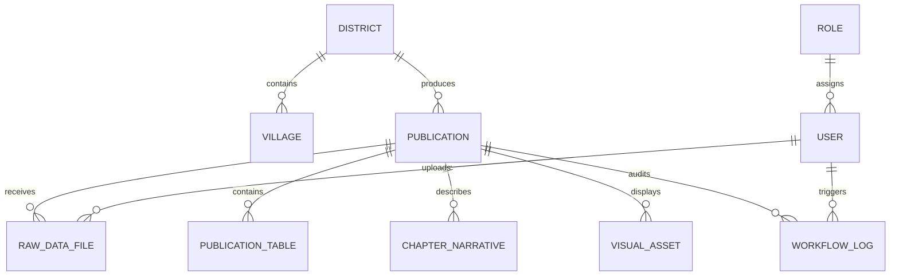

# DOKUMENTASI LENGKAP SISTEM INFORMASI SI-PENA
## (Sistem Penerbitan Angka) - BPS Kabupaten Jember

> **Satuan Kerja:** Badan Pusat Statistik Kabupaten Jember (Kode Wilayah 3509)  
> **Tagline:** *"Goresan Angka Pasti untuk Masa Depan Jember."*  
> **Akses Lokal / Intranet:** [http://sipena.test](http://sipena.test) atau `http://localhost:8000`  
> **Versi Rilis:** 1.0.0 (Production Ready - Intranet Workstation)  
> **Tahun Rilis:** 2026

---

## DAFTAR ISI

1. [Bab 1: Pendahuluan & Filosofi Sistem](#bab-1-pendahuluan--filosofi-sistem)
   * 1.1 Latar Belakang & Masalah Operasional
   * 1.2 Tujuan & Manfaat Utama
   * 1.3 Lingkup Publikasi yang Didukung
2. [Bab 2: Arsitektur Tri-Language Separation](#bab-2-arsitektur-tri-language-separation)
   * 2.1 Peran PHP 8.2 (Laravel 11)
   * 2.2 Peran Python 3.10+ (Analytical Worker)
   * 2.3 Peran Typst Standalone CLI (Typesetting Engine)
   * 2.4 Diagram Alur Proses Inter-Process Communication (IPC)
3. [Bab 3: Arsitektur Basis Data & Model Relasional](#bab-3-arsitektur-basis-data--model-relasional)
   * 3.1 Entitas Inti & Skema Tabel
   * 3.2 Kamus Data & Relasi Antar-Entitas
   * 3.3 Struktur Data JSON Dinamis
4. [Bab 4: Alur Kerja & Mesin Status (Workflow State Machine)](#bab-4-alur-kerja--mesin-status-workflow-state-machine)
   * 4.1 Tahapan Status Bab Publikasi
   * 4.2 Matriks Hak Akses Berbasis Peran (RBAC)
   * 4.3 Mekanisme Locking & Audit Trail
5. [Bab 5: Panduan Operasional Modul Aplikasi](#bab-5-panduan-operasional-modul-aplikasi)
   * 5.1 Modul Dashboard Utama & Monitoring Deadline
   * 5.2 Modul Ingesti Data OPD & Pembersihan Excel
   * 5.3 Modul Meja Redaksi & Narasi Bilingual Berbasis Token
   * 5.4 Modul Persetujuan & Kendali Mutu (Approval)
   * 5.5 Modul Kompilasi Typst & Antrean Batch (Queue)
   * 5.6 Modul Analisis Survei Kebutuhan Data (SKD)
   * 5.7 Modul Desain Cover & Pembatas Bab
6. [Bab 6: Panduan Instalasi, Konfigurasi & DevOps Windows 11](#bab-6-panduan-instalasi-konfigurasi--devops-windows-11)
   * 6.1 Persyaratan Lingkungan Host Workstation
   * 6.2 Konfigurasi Virtual Host Laragon (sipena.test)
   * 6.3 Setup Virtual Environment Python & Dependensi
   * 6.4 Binary Standalone Typst Compiler
   * 6.5 Konfigurasi Database & Seed Master Data
7. [Bab 7: Pengujian, Verifikasi & Pemecahan Masalah (Troubleshooting)](#bab-7-pengujian-verifikasi--pemecahan-masalah-troubleshooting)
   * 7.1 Eksekusi Pengujian Otomatis
   * 7.2 Masalah Lingkungan Windows & Solusinya
   * 7.3 Log Error & Pemeliharaan Berkala

---

## BAB 1: PENDAHULUAN & FILOSOFI SISTEM

### 1.1 Latar Belakang & Masalah Operasional
Penerbitan statistik daerah di BPS Kabupaten Jember sebelumnya sangat bergantung pada perangkat lunak tata letak desktop manual (Adobe InDesign). Proses konvensional ini memiliki sejumlah kelemahan kritis:
1. **Beban Kerja Desain Berulang:** Tim publikasi harus menyusun ratusan tata letak secara manual (31 Kecamatan x 7 bab = 217 bab KDA, ditambah 13 bab DDA dan laporan SKD).
2. **Kekacauan Format Data Mentah OPD:** File Excel kiriman Organisasi Perangkat Daerah (OPD) dan instansi sektoral kerap memiliki *merged cells*, baris kosong, header ganda, tipe data campuran, serta penulisan nama desa/kecamatan yang tidak konsisten (typo).
3. **Risiko Desinkronisasi Angka Narasi:** Saat angka dalam tabel direvisi mendekati tenggat waktu, narasi ulasan teks sering kali terlambat diperbarui karena pengeditan manual yang terpisah.
4. **Perhitungan Manual Survei Kebutuhan Data:** Pengolahan bobot Indeks Kepuasan Konsumen (IKK), Indeks Persepsi Anti Korupsi (IPAK), Gap Analysis, dan pemetaan Diagram Kartesius Importance and Performance Analysis (IPA) dilakukan semi-manual di spreadsheet.
5. **Ketiadaan Jejak Audit (Audit Trail):** Revisi file Excel berulang kali oleh dinas sering memicu sengketa keabsahan angka tanpa bukti arsip berkas asli yang tidak dapat diubah (*immutable*).

### 1.2 Tujuan & Manfaat Utama
SI-PENA dirancang sebagai solusi terintegrasi berbasis web intranet untuk:
* **Mengotomatisasi 100% proses typesetting** publikasi resmi BPS menggunakan mesin kompilasi modern Typst.
* **Memvalidasi dan membersihkan data mentah Excel OPD secara otomatis** menggunakan algoritma Python dan Fuzzy Matching kewilayahan (31 kecamatan & 248 desa/kelurahan).
* **Menyinkronkan angka ulasan secara otomatis** melalui sistem narasi berbasis token dinamis dalam dua bahasa (Bilingual: Indonesia & Inggris).
* **Menjamin integritas dan transparansi angka** melalui pencatatan log alur kerja (*audit trail*) dan pengarsipan berkas mentah berbasis hash kriptografi SHA-256.

### 1.3 Lingkup Publikasi yang Didukung
1. **Kecamatan Dalam Angka (KDA):** 31 publikasi kecamatan se-Kabupaten Jember (Kode Wilayah 3509010 - 3509310), format buku A5 standar BPS, 7 bab per buku.
2. **Kabupaten Jember Dalam Angka (DDA):** Buku induk statistik daerah, format A5/B5, 350+ halaman, 13 bab lintas sektor.
3. **Laporan Hasil Survei Kebutuhan Data (SKD):** Laporan analitis tahunan berbasis kuesioner VKD, format B5, mencakup IKK, IPAK, Gap Analysis, dan grafik vektor kuadran IPA (A, B, C, D).

---

## BAB 2: ARSITEKTUR TRI-LANGUAGE SEPARATION

Sistem menerapkan prinsip pemisahan tanggung jawab secara ketat (*Strict Tri-Language Separation*) untuk memaksimalkan efisiensi, stabilitas, dan kemudahan pemeliharaan:

```
┌─────────────────────────────────────────────────────────────────────────────┐
│                            ARSITEKTUR SI-PENA                               │
├─────────────────────────────────────────────────────────────────────────────┤
│                                                                             │
│  [ LAPIS 1: WEB APPLICATION & ORCHESTRATION ]                               │
│  Teknologi: PHP 8.2 / Laravel 11                                            │
│  Tanggung Jawab:                                                            │
│  - Antarmuka pengguna responsif (Blade Template + Tailwind CSS + Alpine.js) │
│  - Autentikasi & Otorisasi RBAC (Operator, Editor, Approver, Viewer)        │
│  - Manajemen Status Bab & Deadlines                                         │
│  - Transaksi Basis Data MySQL 8.0 & Penyimpanan Berkas                      │
│  - Orkestrator Eksekusi Background CLI Worker (Symfony Process)             │
│                                                                             │
│                     │                                   │                   │
│                     ▼ (CLI IPC)                         ▼ (CLI IPC)         │
│  [ LAPIS 2: ANALYTICAL WORKER ]             [ LAPIS 3: TYPESETTING ENGINE ] │
│  Teknologi: Python 3.10+ (Isolated Venv)    Teknologi: Typst CLI (typst.exe)│
│  Tanggung Jawab:                            Tanggung Jawab:                 │
│  - Pembersihan file Excel kotor             - 100% Perakitan PDF cetak      │
│  - Fuzzy Matching wilayah desa/kecamatan    - Master Layout A5 / B5         │
│  - Agregasi data baris individu             - Generator Cover & Divider Bab │
│  - Kalkulasi matriks SKD (IKK, IPAK, Gap)   - Render tabel presisi tinggi   │
│  - Rendering grafik vektor SVG (Matplotlib) - Output PDF Standar Percetakan │
│                                                                             │
└─────────────────────────────────────────────────────────────────────────────┘
```

### 2.1 Peran PHP 8.2 (Laravel 11)
Laravel bertindak sebagai konduktor orkestrasi:
- **Routing HTTP & Antarmuka:** Melayani halaman dashboard dan meja kerja pegawai kantor BPS.
- **Manajemen Alur Kerja:** Memastikan setiap bab hanya dapat berpindah status sesuai izin pengguna dan validitas data.
- **Keamanan:** Memvalidasi file upload, mengenkripsi password, melindungi dari CSRF/XSS, dan mengelola sesi pengguna.
- **Inter-Process Communication (IPC):** Menggunakan `Symfony\Component\Process\Process` untuk memanggil script Python dan Typst CLI secara aman dan asinkron tanpa membebani thread web server.

### 2.2 Peran Python 3.10+ (Analytical Worker)
Python bertanggung jawab penuh atas komputasi berat dan pemrosesan data mentah:
- Script terisolasi di direktori `python_engine/`.
- Memakai virtual environment mandiri di `python_engine/venv/`.
- Berkomunikasi dengan PHP murni melalui format **JSON via standard output (stdout)**.
- Modul utama:
  * `parsers/generic_cleaner.py`: Ekstraksi tabel data dinas, pembersihan merge cells, parsing tipe data.
  * `parsers/individual_aggregator.py`: Agregasi data individu per desa/sekolah (misal: data Dapodik).
  * `calculators/skd_engine.py`: Penghitungan matriks kepuasan konsumen, gap analysis, dan kuadran IPA.
  * `visualizers/population_pyramid.py`: Render SVG piramida penduduk berbasis umur dan jenis kelamin.
  * `visualizers/climate_chart.py`: Render diagram kombinasi batang-garis curah hujan dan hari hujan.

### 2.3 Peran Typst Standalone CLI (`typst.exe` v0.15.1)
Typst menggantikan seluruh kebutuhan terhadap InDesign, LaTeX, dan library PDF berbasis PHP:
- Binary portabel ditempatkan di `typst_engine/bin/typst.exe`.
- Kecepatan kompilasi dalam hitungan milidetik per dokumen.
- Template master modular di `typst_engine/templates/`:
  * `kda_master.typ`: Template buku Kecamatan Dalam Angka (Format A5).
  * `dda_master.typ`: Template Kabupaten Jember Dalam Angka (Format A5/B5).
  * `skd_master.typ`: Template Laporan Analisis Survei Kebutuhan Data (Format B5).
  * `components/`: Komponen pembangun (`cover.typ`, `divider.typ`, `tables.typ`).

---

## BAB 3: ARSITEKTUR BASIS DATA & MODEL RELASIONAL

Sistem menggunakan basis data MySQL 8.0 (Engine: InnoDB, Collation: `utf8mb4_unicode_ci`) yang mendukung kolom bertipe JSON untuk menyimpan matriks data dinamis.



### 3.1 Entitas & Skema Tabel Utama

1. **`districts` (Kecamatan):**
   * `id`: Primary key.
   * `code`: Kode BPS (misal: `3509010` untuk Kencong).
   * `name`: Nama resmi kecamatan (misal: `Kencong`).
   * `capital_name`: Nama ibukota kecamatan.
   * `total_villages`: Jumlah desa/kelurahan.
   * `total_area_km2`: Luas wilayah dalam kilometer persegi.

2. **`villages` (Desa / Kelurahan):**
   * `id`: Primary key.
   * `district_id`: Foreign key ke tabel `districts`.
   * `code`: Kode wilayah BPS desa/kelurahan (10 digit).
   * `name`: Nama resmi desa/kelurahan.
   * `is_kelurahan`: Boolean penanda status kelurahan atau desa.

3. **`publications` (Publikasi):**
   * `id`: Primary key.
   * `type`: Enum (`KDA`, `DDA`, `SKD`).
   * `title`: Judul resmi (misal: *Kecamatan Kencong Dalam Angka 2026*).
   * `edition_year`: Tahun publikasi (contoh: 2026).
   * `district_id`: Foreign key opsional (hanya untuk tipe `KDA`).
   * `current_status`: Enum status keseluruhan (`DRAFT`, `IN_REVIEW`, `APPROVED`, `RELEASED`).
   * `final_pdf_path`: Lokasi file PDF hasil kompilasi final.
   * `deadline_at`: Batas akhir penyelesaian publikasi.

4. **`raw_data_files` (Arsip Berkas Mentah OPD):**
   * `id`: Primary key.
   * `publication_id`: Foreign key ke tabel `publications`.
   * `original_filename`: Nama file Excel asli saat diunggah.
   * `stored_path`: Lokasi file di direktori server (`storage/app/private/raw_excel/...`).
   * `file_sha256`: Hash SHA-256 untuk verifikasi keaslian dan audit anti-manipulasi.
   * `chapter_number`: Bab tujuan (1 - 7 untuk KDA).
   * `uploaded_by`: Foreign key ke tabel `users`.
   * `parsed_status`: Enum (`PENDING`, `PARSED_SUCCESS`, `PARSE_FAILED`).

5. **`mapping_schemas` (Aturan Pemetaan Data):**
   * `id`: Primary key.
   * `name`: Nama skema (misal: *Skema Penduduk Disdukcapil*).
   * `source_type`: Tipe sumber data (`EXCEL_OPD`, `CSV_DAPODIK`, `VKD_SKD`).
   * `column_rules`: Definisi JSON aturan pemetaan nama kolom, tipe data, dan aturan validasi.

6. **`publication_tables` (Tabel Terstruktur Publikasi):**
   * `id`: Primary key.
   * `publication_id`: Foreign key ke tabel `publications`.
   * `chapter_number`: Nomor bab.
   * `table_number`: Nomor tabel resmi (misal: `1.1.1`).
   * `title_id`: Judul tabel dalam Bahasa Indonesia.
   * `title_en`: Judul tabel dalam Bahasa Inggris.
   * `table_data`: Data matriks dalam format JSON (kolom, baris, nilai numerik).
   * `unit`: Satuan data (contoh: *Jiwa*, *Hektar*, *Ton*).
   * `source_note`: Catatan sumber data resmi (misal: *Dinas Pendidikan Kabupaten Jember*).

7. **`chapter_narratives` (Ulasan Teks Bab):**
   * `id`: Primary key.
   * `publication_id`: Foreign key ke tabel `publications`.
   * `chapter_number`: Nomor bab (1 - 7).
   * `title`: Judul bab (misal: *Geografi dan Iklim*).
   * `content_id`: Teks ulasan Bahasa Indonesia dengan token dinamis `{token}`.
   * `content_en`: Teks ulasan Bahasa Inggris dengan token dinamis.
   * `status`: Status bab (`PENDING_DATA`, `DATA_INGESTED`, `IN_EDITORIAL`, `PENDING_APPROVAL`, `APPROVED_LOCKED`, `REVISION_REQUIRED`).
   * `highlight_tokens`: JSON pasangan kunci-nilai token data (misal: `{"penduduk_total": "72,450"}`).

8. **`visual_assets` (Aset Visual & Cover):**
   * `id`: Primary key.
   * `publication_id`: Foreign key ke tabel `publications`.
   * `asset_type`: Enum (`COVER_IMAGE`, `DISTRICT_MAP`, `CHART_SVG`, `DIVIDER_BG`).
   * `file_path`: Path file di direktori storage.
   * `is_active`: Penanda status aset aktif yang digunakan dalam kompilasi.

9. **`workflow_logs` (Jejak Rekam Aktivitas & Audit):**
   * `id`: Primary key.
   * `publication_id`: Foreign key ke tabel `publications`.
   * `chapter_number`: Nomor bab terkait.
   * `user_id`: Pengguna yang memicu aksi.
   * `action`: Jenis aksi (`UPLOAD_EXCEL`, `EDIT_NARRATIVE`, `SUBMIT_APPROVAL`, `APPROVE_CHAPTER`, `REJECT_CHAPTER`, `COMPILE_PDF`).
   * `old_status`: Status sebelum perubahan.
   * `new_status`: Status setelah perubahan.
   * `notes`: Catatan revisi atau pesan persetujuan.

---

## BAB 4: ALUR KERJA & MESIN STATUS (WORKFLOW STATE MACHINE)

### 4.1 Tahapan Status Bab Publikasi

Setiap bab dalam publikasi harus melalui siklus kontrol kualitas yang ketat:

```
  [1. PENDING_DATA]
          │
          ▼ (Operator mengunggah Excel OPD yang lolos verifikasi Python)
  [2. DATA_INGESTED]
          │
          ▼ (Sistem mengisi token angka & Editor menyunting narasi ulasan)
  [3. IN_EDITORIAL]
          │
          ▼ (Editor mengajukan bab untuk persetujuan)
  [4. PENDING_APPROVAL]
          │
          ├─────────────────────────┐
          │ (Jika ditolak)          │ (Jika disetujui)
          ▼                         ▼
  [REVISION_REQUIRED]       [5. APPROVED_LOCKED]
          │                         │
          │ (Kembali diperbaiki)    │ (Semua bab 1-7 disetujui)
          └──────► [IN_EDITORIAL]   ▼
                            [6. FINAL_RELEASED] ──► (Kompilasi PDF Siap Cetak)
```

### 4.2 Matriks Hak Akses Pengguna (RBAC)

| Peran (*Role*) | Akses Menu | Hak Operasional | Batasan |
| :--- | :--- | :--- | :--- |
| **Operator** | Ingestion Data | Unggah Excel OPD, trigger cleaner Python, mapping kolom, lihat hasil tabel. | Tidak dapat mengubah narasi bab atau menyetujui status bab. |
| **Editor** | Meja Redaksi | Menyunting teks ulasan bab (ID/EN), mengatur token dinamis, submit approval. | Tidak dapat menyetujui bab sendiri atau mengompilasi PDF rilis final. |
| **Approver** | Meja Persetujuan | Memeriksa kepatuhan data, melakukan *Approve & Lock* bab, atau *Reject* dengan catatan. | Mengunci bab secara permanen sehingga tidak dapat disunting kembali. |
| **Viewer** | Dashboard & Monitor | Memantau persentase progres 31 kecamatan, melihat tabel data, mengunduh draf. | Bersifat hanya-baca (*read-only*). |

---

## BAB 5: PANDUAN OPERASIONAL MODUL APLIKASI

### 5.1 Modul Dashboard Utama (`/dashboard`)
* **URL:** `http://sipena.test/dashboard`
* **Fungsi:** Menyajikan ringkasan eksekutif seluruh publikasi BPS Kabupaten Jember.
* **Fitur Utama:**
  - Kartu Ringkasan: Total KDA (31), Total DDA (1), Total Laporan SKD (1).
  - Indikator Status Global: Jumlah bab berstatus *Draft*, *In Review*, *Locked*, dan *Released*.
  - Matriks Progress 31 Kecamatan: Tabel pemantauan status real-time 31 kecamatan di Kabupaten Jember beserta indikator persentase kelengkapan data.

### 5.2 Modul Ingesti Data OPD (`/ingestion`)
* **URL:** `http://sipena.test/ingestion`
* **Aktor:** Operator Data
* **Fungsi:** Mengunggah file Excel dinas mentah dan menjalankan proses pembersihan otomatis.
* **Langkah Penggunaan:**
  1. Pilih Publikasi tujuan (misal: *Kecamatan Kencong Dalam Angka 2026*).
  2. Tentukan Nomor Bab terkait (Bab 1 s.d. Bab 7).
  3. Unggah berkas Excel (`.xlsx` / `.xls`).
  4. Klik tombol **Unggah & Bersihkan Otomatis**.
  5. Sistem menjalankan `python_engine/parsers/generic_cleaner.py` secara instan:
     - Menghapus baris kosong dan merged cells.
     - Melakukan fuzzy matching nama desa terhadap 248 desa resmi Jember.
     - Menyimpan hash SHA-256 berkas asli ke tabel `raw_data_files`.
     - Mengisi data tabel ke `publication_tables` dan memperbarui status bab menjadi `DATA_INGESTED`.

### 5.3 Modul Meja Redaksi (`/editorial`)
* **URL:** `http://sipena.test/editorial`
* **Aktor:** Editor Publikasi
* **Fungsi:** Menyunting ulasan narasi bab dalam dua bahasa (Indonesia & Inggris).
* **Fitur Token Dinamis:**
  - Penulis dapat memasukkan token dinamis di dalam teks, seperti:
    * `{nama_kecamatan}`: Menghasilkan nama kecamatan (contoh: *Kencong*).
    * `{luas_wilayah}`: Luas wilayah resmi dalam km².
    * `{jumlah_desa}`: Jumlah desa/kelurahan di kecamatan tersebut.
    * `{penduduk_total}`: Angka agregat penduduk terbaru.
  - Saat tabel data diperbarui oleh Operator, angka di dalam narasi yang menggunakan token akan **otomatis ikut terbarui** tanpa risiko desinkronisasi.
  - Tombol **Ajukan Persetujuan**: Mengubah status bab menjadi `PENDING_APPROVAL`.

### 5.4 Modul Persetujuan & Kendali Mutu (`/approval`)
* **URL:** `http://sipena.test/approval`
* **Aktor:** Approver (Ketua Tim / Koordinator Publikasi)
* **Fungsi:** Memeriksa dan mengunci kualitas bab publikasi.
* **Langkah Penggunaan:**
  1. Memilih bab yang berstatus `PENDING_APPROVAL`.
  2. Memeriksa kesesuaian antara tabel data, catatan sumber, dan narasi ulasan.
  3. **Jika Sesuai:** Klik tombol **Setujui & Kunci Bab (Approve & Lock)**. Status bab menjadi `APPROVED_LOCKED`. Bab tidak dapat disunting kembali oleh siapapun.
  4. **Jika Perlu Koreksi:** Masukkan catatan perbaikan pada formulir revisi, lalu klik **Tolak (Reject)**. Status bab berubah menjadi `REVISION_REQUIRED` dan dikembalikan ke antrean Editor/Operator.

### 5.5 Modul Kompilasi Typst & Antrean Batch (`/compilation`)
* **URL:** `http://sipena.test/compilation`
* **Aktor:** Approver & Koordinator Rilis
* **Fitur Utama:**
  - **Kompilasi Mandiri Satuan (Single Compile):** Mengompilasi 1 publikasi terpilih secara langsung menggunakan `typst.exe`. File PDF draf/rilis segera dihasilkan di `storage/output_pdf/2026/`.
  - **Batch Compile 31 KDA (Antrean Latar Belakang):** Menjalankan pemrosesan seluruh 31 publikasi KDA Kabupaten Jember secara paralel/antrean menggunakan Laravel Queue (`CompilePublicationJob`).
  - **Unduh PDF Langsung:** Tombol download instan untuk berkas PDF cetak yang telah selesai dirakit.

### 5.6 Modul Analisis Survei Kebutuhan Data (`/skd`)
* **URL:** `http://sipena.test/skd`
* **Fungsi:** Mengolah kuesioner VKD untuk penyusunan Buku Laporan Hasil SKD.
* **Kemampuan Engine Python (`skd_engine.py`):**
  - Kalkulasi **Indeks Kepuasan Konsumen (IKK)** per unsur pelayanan (SP1 - SP6).
  - Kalkulasi **Indeks Persepsi Anti Korupsi (IPAK)** (SP7 - SP10).
  - Kalkulasi **Gap Analysis** (Tingkat Kepuasan vs Tingkat Kepentingan).
  - Pemetaan otomatis atribut pelayanan ke dalam 4 Kuadran Diagram Kartesius IPA:
    * **Kuadran A (Prioritas Utama / *Concentrate Here*):** Kepentingan tinggi, kepuasan rendah.
    * **Kuadran B (Pertahankan Prestasi / *Keep Up the Good Work*):** Kepentingan tinggi, kepuasan tinggi.
    * **Kuadran C (Prioritas Rendah / *Low Priority*):** Kepentingan rendah, kepuasan rendah.
    * **Kuadran D (Berlebihan / *Possibly Overkill*):** Kepentingan rendah, kepuasan tinggi.

### 5.7 Modul Desain Cover & Pembatas Bab (`/covers`)
* **URL:** `http://sipena.test/covers`
* **Fungsi:** Mengelola aset visual publikasi.
* **Fitur:**
  - Unggah foto cover kustom beresolusi tinggi (format JPG/PNG).
  - Pratinjau otomatis tata letak sampul depan dan belakang sesuai standar grafis BPS.
  - Pengelolaan foto latar belakang pembatas bab (*chapter divider*).

---

## BAB 6: PANDUAN INSTALASI, KONFIGURASI & DEVOPS WINDOWS 11

### 6.1 Persyaratan Lingkungan Host Workstation
Aplikasi dirancang secara spesifik untuk berjalan optimal pada satu PC server/workstation intranet dengan spesifikasi:
* **OS:** Windows 11 Pro 64-bit
* **Web Stack:** Laragon Full Suite (Apache 2.4.54, PHP 8.2.32, MySQL 8.0.30)
* **Python Engine:** Python 3.10 / 3.11 / 3.12 (64-bit)
* **Typesetting Engine:** Typst Standalone Binary (`typst.exe` v0.15.1)
* **Jaringan:** Intranet LAN Port 80 & 443 (Domain `sipena.test`) atau Port 8000.

### 6.2 Konfigurasi Virtual Host Laragon (`sipena.test`)

File konfigurasi Apache Virtual Host telah dibuat di:
`C:\laragon\etc\apache2\sites-enabled\auto.sipena.test.conf`

```apache
<VirtualHost *:80>
    DocumentRoot "C:/laragon/www/sipena/public"
    ServerName sipena.test
    ServerAlias *.sipena.test
    <Directory "C:/laragon/www/sipena/public">
        AllowOverride All
        Require all granted
    </Directory>
</VirtualHost>

<VirtualHost *:443>
    DocumentRoot "C:/laragon/www/sipena/public"
    ServerName sipena.test
    ServerAlias *.sipena.test
    SSLEngine on
    SSLCertificateFile "C:/laragon/etc/ssl/laragon.crt"
    SSLCertificateKeyFile "C:/laragon/etc/ssl/laragon.key"

    <Directory "C:/laragon/www/sipena/public">
        AllowOverride All
        Require all granted
    </Directory>
</VirtualHost>
```

#### Cara Registrasi Domain 1-Klik:
Jalankan file batch:
`C:\laragon\www\register-sipena-domain.bat`
Skrip ini akan otomatis meminta hak Administrator dan menambahkan entri:
```text
127.0.0.1      sipena.test  #laragon magic!
```
ke file `C:\Windows\System32\drivers\etc\hosts`.

### 6.3 Setup Virtual Environment Python & Dependensi

Python worker engine menggunakan isolasi venv pada direktori `python_engine/venv/`.
Dependensi Python:
```bash
cd C:\laragon\www\sipena\python_engine
.\venv\Scripts\pip.exe install pandas openpyxl matplotlib numpy
```

### 6.4 Binary Standalone Typst Compiler
Binary portabel `typst.exe` ditempatkan di:
`C:\laragon\www\sipena\typst_engine\bin\typst.exe`
Verifikasi versi:
```powershell
C:\laragon\www\sipena\typst_engine\bin\typst.exe --version
# Output: typst 0.15.1
```

### 6.5 Konfigurasi Database & Seed Master Data

1. **Konfigurasi Berkas `.env`:**
   ```env
   APP_NAME="SI-PENA"
   APP_ENV=local
   APP_DEBUG=false
   APP_URL=http://sipena.test

   DB_CONNECTION=mysql
   DB_HOST=127.0.0.1
   DB_PORT=3306
   DB_DATABASE=sipena
   DB_USERNAME=sipena_app
   DB_PASSWORD=<buat_sendiri>
   ```

   Gunakan akun MySQL khusus aplikasi (`sipena_app`) dengan hak akses hanya pada
   database `sipena`; jangan memakai `root` pada server produksi.

2. **Migrasi & Seeder Master Data BPS Jember:**
   ```powershell
   php artisan migrate:fresh --seed
   ```
   Perintah ini akan secara otomatis mengisi:
   * 4 Peran Pengguna (Operator, Editor, Approver, Viewer).
   * 4 Pengguna default untuk setiap peran.
   * 31 Kecamatan se-Kabupaten Jember (Lengkap dengan kode BPS, luas wilayah, dan ibukota kecamatan).
   * 33 Publikasi Awal (31 KDA, 1 DDA, 1 Laporan SKD).

---

## BAB 7: PENGUJIAN, VERIFIKASI & PEMECAHAN MASALAH (TROUBLESHOOTING)

### 7.1 Eksekusi Pengujian Otomatis
Sistem dilengkapi dengan skrip pengujian terintegrasi untuk memverifikasi fungsionalitas seluruh lapisan:
```powershell
cd C:\laragon\www\sipena
& "python_engine\venv\Scripts\python.exe" tests\e2e\test_e2e_sipena.py
```
Output pengujian memverifikasi:
- Status kompilasi template Typst (KDA, DDA, SKD).
- Kalkulasi formula SKD dan ekspor diagram kuadran IPA.
- Hasil rendering grafik SVG Piramida Penduduk dan Curah Hujan.

### 7.2 Masalah Lingkungan Windows & Solusinya

#### A. Error `RuntimeError: Could not determine home directory` pada Matplotlib
* **Penyebab:** Pada Windows 11, proses latar belakang yang dieksekusi melalui PHP `symfony/process` terkadang tidak membawa variabel lingkungan `USERPROFILE` atau `HOMEPATH`.
* **Solusi Sistem:** Pada seluruh controller PHP dan worker Python, variabel lingkungan `MPLCONFIGDIR` telah diarahkan secara eksplisit ke direktori sementara yang dapat ditulis (`storage/temp`):
  ```php
  $process->setEnv([
      'USERPROFILE'   => 'C:\\Users\\IPDS',
      'MPLCONFIGDIR'  => storage_path('temp'),
      'PYTHONHASHSEED'=> '0'
  ]);
  ```

#### B. Error Import Root-Relative pada Typst 0.15
* **Penyebab:** Parameter `--root` pada Typst 0.15 mewajibkan seluruh path `#import` yang diawali garis miring (`/`) merujuk secara absolut dari root direktori proyek (`C:\laragon\www\sipena`).
* **Solusi Sistem:** Seluruh pemanggilan template master dikonfigurasi dengan path:
  ```typst
  #import "/typst_engine/templates/kda_master.typ": *
  ```

#### C. Akses `PermissionDenied` Saat Mengubah Hosts File
* **Solusi:** Gunakan berkas `register-sipena-domain.bat` yang secara otomatis memicu dialog persetujuan Administrator (*UAC elevation*) atau klik kanan ikon Laragon di system tray -> *Apache* -> *Reload*.

### 7.3 Log Error & Pemeliharaan Berkala
* **Log Aplikasi Laravel:** `storage/logs/laravel.log`
* **Log Web Server Apache:** `C:\laragon\bin\apache\httpd-2.4.54-win64-VS16\logs\error.log`
* **Arsip PDF Hasil Kompilasi:** `storage/output_pdf/2026/`
* **Pembersihan Cache:**
  ```powershell
  php artisan optimize:clear
  ```

---
*Dokumentasi ini disusun sebagai panduan teknis dan operasional resmi untuk BPS Kabupaten Jember.*
