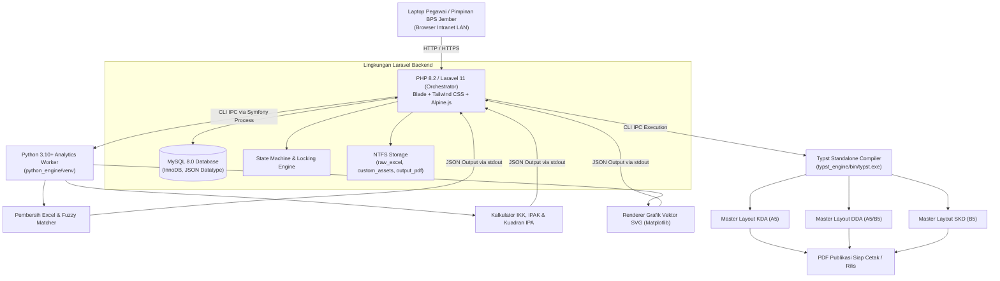
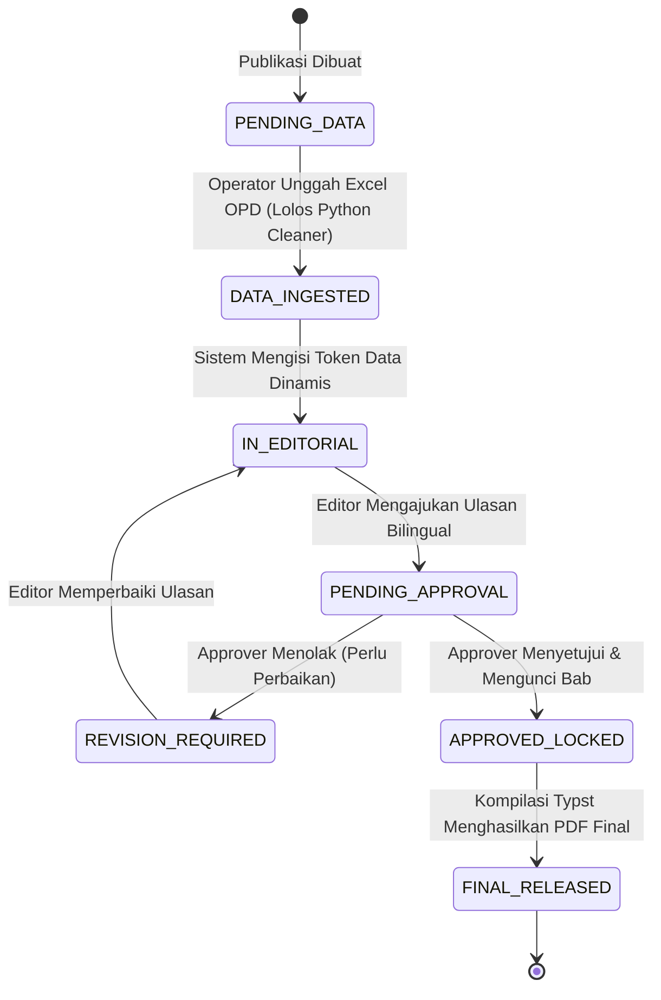

# BUKU PANDUAN & DOKUMENTASI LENGKAP SISTEM
# SI-PENA (Sistem Penerbitan Angka)
**Badan Pusat Statistik Kabupaten Jember (Satker Kode Wilayah 3509)**  
*Tagline: "Goresan Angka Pasti untuk Masa Depan Jember."*

---

> [!NOTE]
> SI-PENA adalah sistem penerbitan dan penataan angka daerah berbasis web intranet untuk BPS Kabupaten Jember. Sistem ini mentransformasi seluruh alur kerja manual berbasis Adobe InDesign menjadi pipeline otomatis mulai dari penerimaan data mentah Excel OPD, pembersihan data dengan Python, penyusunan narasi bilingual berbasis token, hingga perakitan PDF publikasi resmi berstandar percetakan dengan mesin Typst.

---

## 1. Rangkuman Eksekutif & Karakteristik Sistem

| Parameter | Spesifikasi Resmi |
| :--- | :--- |
| **Nama Aplikasi** | **SI-PENA (Sistem Penerbitan Angka)** |
| **Instansi Pemilik** | BPS Kabupaten Jember (Kode Wilayah: 3509) |
| **Lingkungan Host** | Windows 11 Pro 64-bit Workstation (Intranet LAN Port 80 & 443 / Port 8000) |
| **Alamat Akses Lokal** | [http://sipena.test](http://sipena.test) |
| **Arsitektur Inti** | *Strict Tri-Language Separation* (PHP 8.2 + Python 3.10+ + Typst CLI) |
| **Basis Data** | MySQL 8.0 (InnoDB, JSON support, utf8mb4_unicode_ci) |
| **Cakupan Publikasi** | 31 Kecamatan Dalam Angka (KDA), 1 Jember Dalam Angka (DDA), 1 Laporan Analisis Survei Kebutuhan Data (SKD) |

---

## 2. Arsitektur Tri-Language Terisolasi

---

## 3. Matriks Peran Pengguna (RBAC) & Hak Operasional

1. **Operator (Data Specialist):**
   * Mengunggah berkas Excel kiriman OPD ke sistem.
   * Memvalidasi hasil pembersihan dan koreksi typo nama desa melalui *Fuzzy Matching*.
   * Memantau status parsing data per tabel.
2. **Editor (Editorial Specialist):**
   * Menyusun ulasan narasi bab dalam format Bilingual (Bahasa Indonesia dan Bahasa Inggris).
   * Memanfaatkan token data dinamis (contoh: `{penduduk_total}`, `{luas_wilayah}`) agar angka ulasan selalu sinkron dengan tabel.
   * Mengajukan bab yang telah selesai diperiksa ke tahap persetujuan.
3. **Approver (Ketua Tim / Koordinator):**
   * Memeriksa keterhubungan antara tabel data, catatan sumber, dan narasi.
   * Memberikan catatan revisi bila ditemukan kekeliruan data.
   * Melakukan aksi *Approve & Lock* yang secara permanen mengunci bab dari perubahan.
   * Mengeksekusi kompilasi PDF final (satuan maupun batch 31 KDA).
4. **Viewer (Pimpinan / Seksi):**
   * Memantau persentase progres penyelesaian 31 kecamatan dan buku induk secara real-time.
   * Mengunduh draf ber-watermark untuk keperluan review awal.

---

## 4. Panduan Modul Operasional

### 4.1 Dashboard Utama (`http://sipena.test/dashboard`)
* Ringkasan eksekutif 33 publikasi aktif BPS Kabupaten Jember.
* Matriks persentase progres 31 kecamatan di Kabupaten Jember:
  - Kencong, Gumukmas, Puger, Wuluhan, Ambulu, Tempurejo, Silo, Mayang, Mumbulsari, Jenggawah, Ajung, Rambipuji, Balung, Semboro, Jombang, Sumberbaru, Tanggul, Bangsalsari, Panti, Sukorambi, Arjasa, Pakusari, Kalisat, Ledokombo, Sumberjambe, Sukowono, Jelbuk, Kaliwates, Sumbersari, Patrang, Pakusari.

### 4.2 Ingestion Data OPD (`http://sipena.test/ingestion`)
* Upload file Excel `.xlsx`/`.xls`.
* Pembersihan otomatis via `parsers/generic_cleaner.py`:
  - Menghapus merged cells, spasi liar, format campur.
  - Fuzzy matching 248 desa/kelurahan resmi Jember.
  - Penyimpanan file mentah dengan hash SHA-256 untuk audit trail anti-sengketa data.

### 4.3 Meja Redaksi & Editorial (`http://sipena.test/editorial`)
* Editor bilingual berdampingan (Kolom Bahasa Indonesia & Bahasa Inggris).
* Dukungan token dinamis otomatis.

### 4.4 Meja Persetujuan (`http://sipena.test/approval`)
* Antarmuka kendali mutu Ketua Tim.
* Tombol *Approve & Lock* serta formulir revisi penolakan.

### 4.5 Modul Kompilasi PDF Typst (`http://sipena.test/compilation`)
* **Single Compile:** Pembuatan PDF instan per buku (kecepatan <0.5 detik).
* **Batch Compile:** Eksekusi antrean latar belakang (Laravel Queue) untuk 31 buku KDA secara otomatis.
* **Download:** Tombol unduh langsung untuk arsip publikasi cetak.

### 4.6 Modul Analisis SKD (`http://sipena.test/skd`)
* Pengolahan instan instrumen VKD.
* Kalkulasi Indeks Kepuasan Konsumen (IKK) dan Indeks Persepsi Anti Korupsi (IPAK).
* Analisis Kesenjangan (*Gap Analysis*).
* Visualisasi otomatis Kuadran A, B, C, D Diagram Kartesius IPA (*Importance-Performance Analysis*).

### 4.7 Modul Desain Cover & Pembatas (`http://sipena.test/covers`)
* Personalisasi sampul depan dan belakang publikasi.
* Manajemen foto resolusi tinggi berlatar identitas BPS Kabupaten Jember.

---

## 5. Indeks Berkas Dokumentasi Teknis

Seluruh dokumentasi rinci telah tersedia di dalam repositori sistem:

1. **[DOKUMENTASI_LENGKAP.md](file:///C:/laragon/www/sipena/DOKUMENTASI_LENGKAP.md)**: Manual induk lengkap seluruh modul, alur, dan kode.
2. **[docs/01_ARSITEKTUR_DAN_DESAIN_SISTEM.md](file:///C:/laragon/www/sipena/docs/01_ARSITEKTUR_DAN_DESAIN_SISTEM.md)**: Detail teknis arsitektur Tri-Language, IPC Symfony Process, dan topologi.
3. **[docs/02_PANDUAN_OPERASIONAL_PENGGUNA.md](file:///C:/laragon/www/sipena/docs/02_PANDUAN_OPERASIONAL_PENGGUNA.md)**: Panduan langkah demi langkah untuk Operator, Editor, dan Approver.
4. **[docs/03_PANDUAN_INSTALASI_DAN_DEVOPS.md](file:///C:/laragon/www/sipena/docs/03_PANDUAN_INSTALASI_DAN_DEVOPS.md)**: Tata cara konfigurasi Windows 11, Laragon Virtual Host, dan Queue Worker.
5. **[docs/04_STRUKTUR_DATABASE_DAN_KAMUS_DATA.md](file:///C:/laragon/www/sipena/docs/04_STRUKTUR_DATABASE_DAN_KAMUS_DATA.md)**: Kamus data tabel, indeks, relasi FK, dan format JSON.
6. **[docs/05_INTEGRASI_PYTHON_DAN_TYPST.md](file:///C:/laragon/www/sipena/docs/05_INTEGRASI_PYTHON_DAN_TYPST.md)**: Formula matematika SKD, script Python, dan layout engine Typst.
7. **[register-sipena-domain.bat](file:///C:/laragon/www/register-sipena-domain.bat)**: Script 1-klik pendaftaran domain lokal `sipena.test`.
